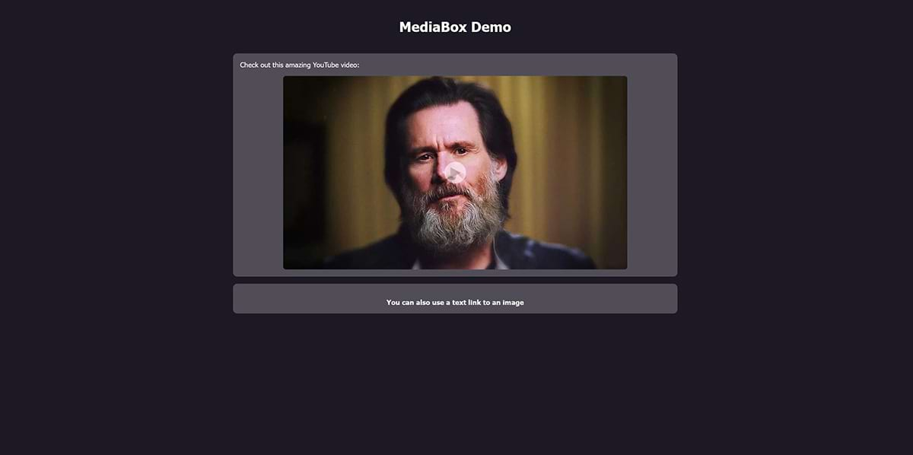

# MediaBox JavaScript Library
## Overview
MediaBox is a minimalist yet potent JavaScript library that elevates media display experience. It's perfect for developers who need a light yet powerful media display tool. It supports a wide array of media types including images, videos, and iframes.

by @[rayheffer](https://www.rayheffer.com)

### Features
* Hover over image effect
* Video play button
* Opens media (E.g. YouTube video) in an overlay, blurring the background
* Automatically detects screen size, and scales the size of the media, which is ideal for mobile devices
* Complete with full CSS styling for an enhanced user experience

### Screenshots
<a href="screenshot01.jpg"></a>

<a href="screenshot02.jpg"></a>

<a href="screenshot03.jpg"></a>


## Demo

[Try it out for yourself!](https://rayheffer.github.io/mediabox/)

## 🚀 Quick Start

### 1. Hosting JavaScript and CSS yourself
To integrate MediaBox into your project, download the `mediabox-min.js` file and include it at the bottom of your HTML file, just before the `</body>` tag.

``` html
<!-- MediaBox JS -->
<script src="path/to/mediabox-min.js"></script>
```

Do the same for `mediabox-min.css`, downloading it and including it in the `<head>` section of your page.

``` html
<!-- MediaBox CSS -->
<link rel="stylesheet" href="mediabox-min.css" type="text/css">
```

### 2. Using a CDN (recommended for most) for the JavaScript and CSS
Instead of downloading and hosting the JavaScript and CSS yourself, you can simply use the CDN (Content Delivery Network) links. CDNs provide a great way to speed up your web project and offer a better user experience. CDNs provide fast, distributed access to static resources by serving them from the nearest location to each user.

Add the MediaBox JavaScript at the bottom of your HTML, just before the `</body>` tag.
``` html
<!-- MediaBox JS -->
<script src="https://cdn.jsdelivr.net/gh/rayheffer/mediabox@main/mediabox-min.js"></script>
```

Add the CSS in the `<head>` section of your HTML.

``` html
<!-- MediaBox CSS -->
<link rel="stylesheet" href="https://cdn.jsdelivr.net/gh/rayheffer/mediabox@main/mediabox-min.css" type="text/css">
```


**Note**: However, as a cybersecurity professional I personally take caution here. The external nature of a CDN means that you're relying on another platform to serve your files. If this platform, or even your own repository, gets compromised, malicious code could be distributed. This is true of any JavaScript library, not just this one. 

## Usage
Create an HTML element, apply the `.mediabox-link` class, and include a `data-url` attribute pointing to your desired media, such as YouTube.

**Note**: Make sure to use YouTube's embed URL, which starts with `https://www.youtube.com/embed/`

``` html
  <div class="mediabox-link" data-url="https://www.youtube.com/embed/wTblbYqQQag?autoplay=1">
      
  </div>
```

### Adding a Play Button (optional)
To overlay a play button, use the play-button-wrapper container. Add it after the image, as shown:

```html
  <div class="mediabox-link" data-url="https://www.youtube.com/embed/wTblbYqQQag?autoplay=1">
      
  <div class="play-button-wrapper">
    <div class="play-button"></div>
  </div>
</div>
```

### Using MediaBox on text links
To use it on a text link, you just need to use `class="mediabox-link"`.

``` html
<a href="demo-content/mario.jpg" class="mediabox-link">You can also use a text link to an image</a>
```

## 🤔 Why Choose Between `mediabox.js` and `mediabox.min.js`?

### `mediabox.js`
Ideal for development purposes, the uncompressed version is your go-to if you wish to debug, extend functionalities, or dive into the nitty-gritty of the code.

### `mediabox.min.js`
For production, I recommend the minified version. It's stripped off any superfluous spaces, line breaks, and comments, resulting in a considerably lighter file primed for performance.

## 🎨 Custom Styling
For custom styles, your options are twofold:

1. Tweak the `mediabox.css` file directly.
2. Create your own stylesheet and go wild!

**Note**: The inline <style> section in index.html serves as a demo styling guide and isn't required for MediaBox's core functionality.